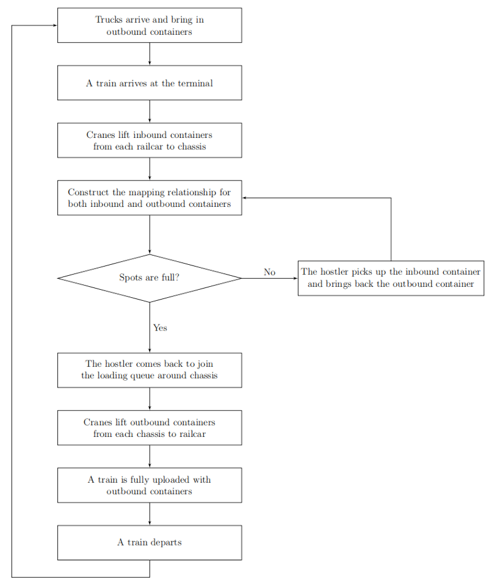

# SimPy-based Rail-road Intermodal Terminal Simulation Model

This document provides an overview of the terminal simulation model implemented using `simpy`. The simulation covers various aspects of terminal operations, including train arrival and departure events, crane cycle, hostler cycle, truck cycle, and the gate process.

## Overview



The simulation models the following key components of terminal operations:
- **Train Arrival**: Managing the arrival of trains.
- **Crane Cycle**: Handling the loading and unloading of containers using cranes.
- **Hostler Cycle**: Transporting containers within the terminal using hostlers.
- **Drayage Cycle**: Managing the movement of containers by trucks.
- **In/Out Gate Process**: Handling the entry and exit of trucks through the terminal gates.
- **Train Departure**: Managing the departure of trains.

## Simulation Parameters

The simulation is configured with the following parameters:

- **General Settings**
  - `RANDOM_SEED`: 42
  - `SIM_TIME`: 1000

- **Yard Settings**
  - `YARD_TYPE`: 'parallel' (options: 'parallel' or 'perpendicular')
  - `YARD_VERT_WTH`: 1
  - `YARD_HORIZ_LTH`: 1
  - `BLOCK_COLUMN_NUM`: 1
  - `BLOCK_ROW_NUM`: 1

- **Train Settings**
  - `TRAIN_UNITS`: User input
  - `TRAIN_SPOTS`: Equal to `TRAIN_UNITS`
  - `TRAIN_ARRIVAL_MEAN`: 10
  - `TRAIN_INSPECTION_TIME`: 1

- **Container Settings**
  - `CONTAINERS_PER_CAR`: 1
  - `INBOUND_CONTAINER_NUMBER`: Calculated as `TRAIN_UNITS * CONTAINERS_PER_CAR`
  - `OUTBOUND_CONTAINER_NUMBER`: Equal to `INBOUND_CONTAINER_NUMBER`

- **Chassis Settings**
  - `CHASSIS_NUMBER`: Equal to `TRAIN_UNITS`

- **Crane Settings**
  - `CRANE_NUMBER`: User input
  - `CONTAINERS_PER_CRANE_MOVE`: 1
  - `CRANE_LOAD_CONTAINER_TIME`: 1
  - `CRANE_UNLOAD_CONTAINER_TIME`: 2
  - `CRANE_INITIALIZE_TIME`: Calculated as `2 * TRAIN_UNITS * CONTAINERS_PER_CAR * CONTAINERS_PER_CRANE_MOVE`

- **Hostler Settings**
  - `HOSTLER_NUMBER`: User input
  - `CONTAINERS_PER_HOSTLER`: 1
  - `HOSTLER_SPEED_LIMIT`: 30
  - `HOSTLER_TRANSPORT_CONTAINER_TIME`: 5
  - `HOSTLER_FIND_CONTAINER_TIME`: 1

- **Truck Settings**
  - `TRUCK_PASS_GATE_TIME`: 1
  - `TRUCK_TO_PARKING`: 2
  - `TRUCK_TRANSPORT_CONTAINER_TIME`: 2
  - `TRUCK_SPEED_LIMIT`: 30
  - `TRUCK_NUMBERS`: Equal to `INBOUND_CONTAINER_NUMBER`

## Simulation Logic

baseline.py

### Train Arrival

Trains arrive at the terminal at random intervals. When a train arrives, it is processed by cranes and hostlers to unload inbound containers and load outbound containers.

### Crane Cycle

Cranes handle the loading and unloading of containers. Each crane can move one container at a time. The simulation tracks the time taken for each crane operation.

### Hostler Cycle

Hostlers transport containers within the terminal. They pick up inbound containers from chassis and drop them off in the parking area. They also pick up outbound containers from the parking area and place them on chassis.

### Truck Cycle

Trucks enter the terminal through a gate, pick up containers, and exit the terminal. The simulation tracks the time taken for each truck operation.

### Gate Process

Trucks pass through the gate to enter and exit the terminal. The simulation tracks the time taken for each truck to pass through the gate.

### Train Departure

The train departs after all outbound containers are loaded.

### Event Recording

The simulation records events for each container, including timestamps for arrival, loading, unloading, and departure. This data is used to calculate average processing times for inbound and outbound containers. It is saved as an Excel file.

## Running the Simulation

To run the simulation, use the following code:

```python
if __name__ == "__main__":
    run_simulation()
